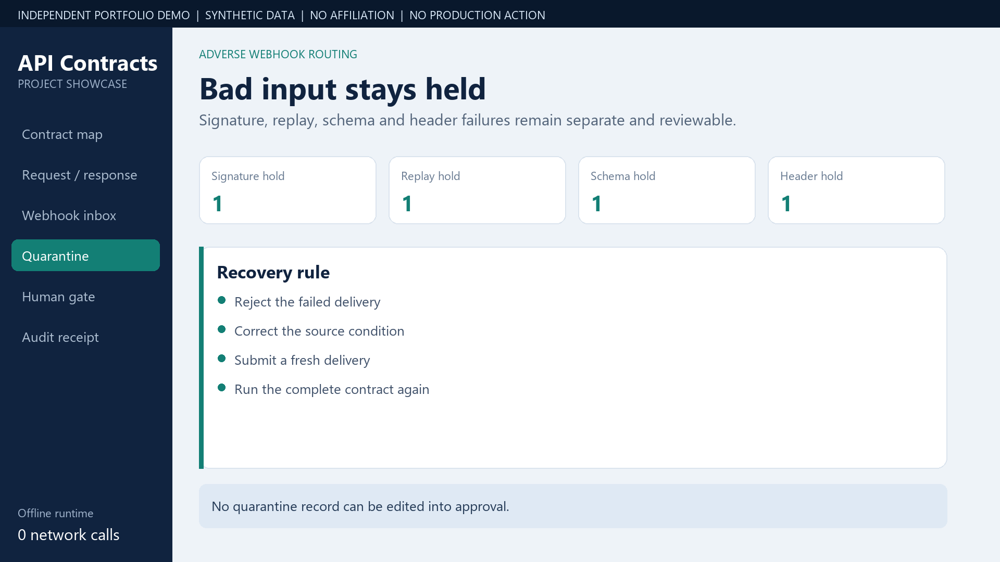
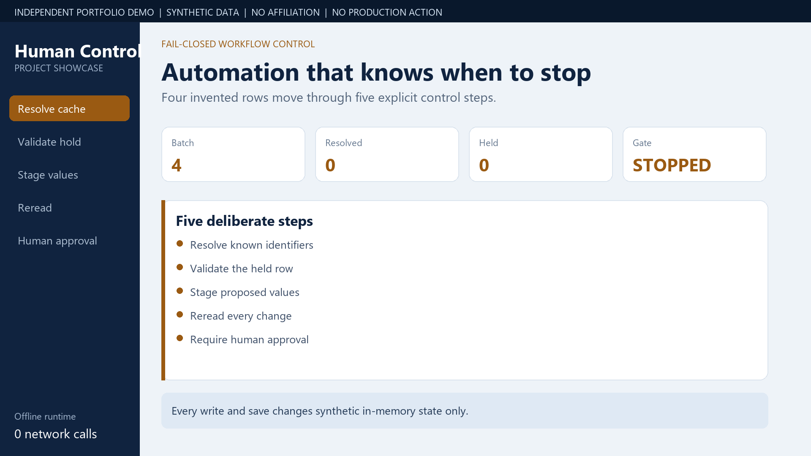
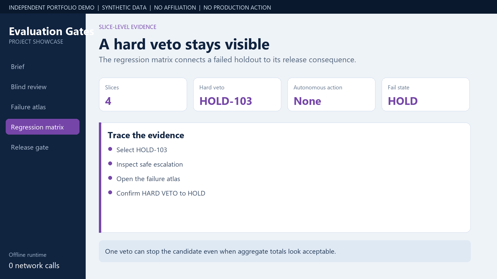
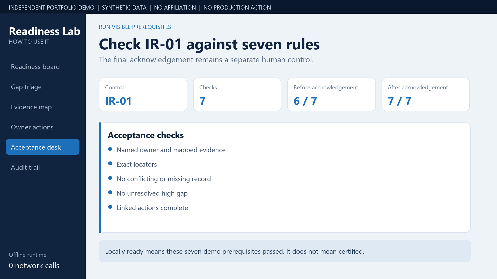
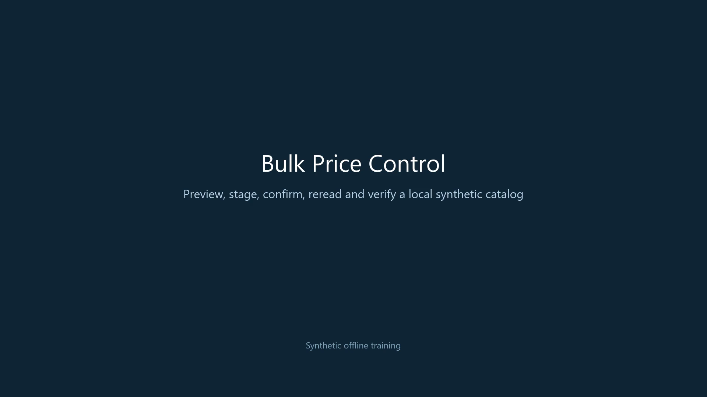

# Video guides

These short videos show the checked-in portfolio demos with synthetic inputs and local, offline behavior. They do not depict employer systems, customer data, live integrations, production actions, or authority to approve a real change.

## API Integration Contracts

The showcase follows contract validation, bounded virtual retries, quarantine, human review, and the audit receipt. The how-to covers the same synthetic fixture in more detail. This demo makes no network request or production write.

[Showcase](../assets/videos/api-integration-contracts-showcase.mp4) | [Vertical showcase](../assets/videos/api-integration-contracts-showcase-vertical.mp4) | [How-to](../assets/videos/api-integration-contracts-how-to.mp4) | [Vertical how-to](../assets/videos/api-integration-contracts-how-to-vertical.mp4) | [Project README](../projects/api-integration-contracts/README.md)

## Human-in-the-Loop Control

The showcase introduces the fail-closed state machine. The how-to walks through identifier resolution, staging, reread verification, mismatch handling, and explicit approval. Every item and result is synthetic, and save actions change only local in-memory demo state.

[Showcase](../assets/videos/human-in-the-loop-control-showcase.mp4) | [Vertical showcase](../assets/videos/human-in-the-loop-control-showcase-vertical.mp4) | [How-to](../assets/videos/human-in-the-loop-control-how-to.mp4) | [Vertical how-to](../assets/videos/human-in-the-loop-control-how-to-vertical.mp4) | [Project README](../projects/human-in-the-loop-control/README.md)

## AI Evaluation Release Gates

The showcase covers exact grading, blind review, holdout reveal, regression checks, and the hard veto that keeps the reference run on hold. The results are precomputed from invented cases. The demo has no runtime network request, inference, deployment action, or release authority.

[Showcase](../assets/videos/ai-evaluation-release-gates-showcase.mp4) | [Vertical showcase](../assets/videos/ai-evaluation-release-gates-showcase-vertical.mp4) | [Project README](../projects/ai-evaluation-release-gates/README.md)

## Implementation Readiness

The how-to follows an invented gap through owner action, review-ready status, seven acceptance checks, a separate human acknowledgement, and a local receipt. The demo runs offline and stores state only in the current browser tab.

[How-to](../assets/videos/implementation-readiness-how-to.mp4) | [Vertical how-to](../assets/videos/implementation-readiness-how-to-vertical.mp4) | [Project README](../projects/implementation-readiness/README.md)

## Bulk Price Control

Bulk Price Control has one 16:9 how-to video. It follows a synthetic price batch through dry run, staging, exact stage confirmation, local commit, reread verification, rollback handling, and audit verification. It does not connect to a point-of-sale system, database, cloud service, or production environment.

[16:9 how-to](../assets/videos/bulk-price-control-how-to.mp4) | [Project README](../projects/bulk-price-control/README.md)
