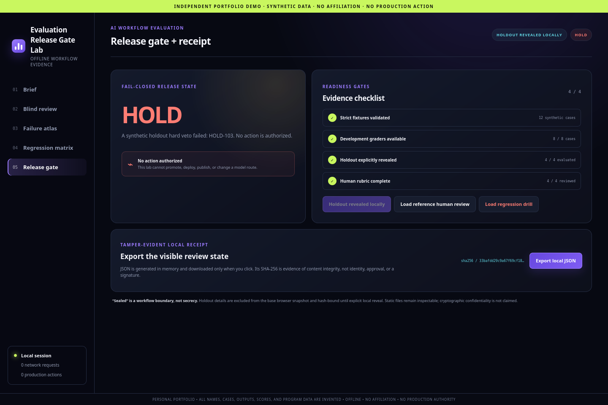

# AI Evaluation Release Gates

> INDEPENDENT PORTFOLIO DEMO · SYNTHETIC DATA · NO AFFILIATION · NO PRODUCTION ACTION

An offline evaluation workspace for separating exact grading, blind human judgment, holdout reveal, regression evidence, and release authority. It evaluates two invented candidates over twelve synthetic cases and fails closed to `PENDING`, `HOLD`, or `ROLLBACK`. No inference, provider, real prompt, customer workflow, or deployment action is present.



[Watch the showcase video](../../docs/VIDEO_GUIDES.md#ai-evaluation-release-gates).

## Run in 60 seconds

Open `index.html` directly in a current browser. For the deterministic core (Python 3.11 or 3.12, standard library only):

```bash
PYTHONDONTWRITEBYTECODE=1 python3 -B -m release_gate demo \
  --contract fixtures/synthetic_evaluation_contract.json \
  --cases fixtures/synthetic_casebook.json \
  --adjudications fixtures/synthetic_adjudications.json
```

No server, account, credential, provider SDK, model, or runtime network is required.

## Five-minute walkthrough

1. On **Brief**, establish the 8-development/4-holdout design and four evaluation dimensions.
2. On **Blind review**, run an exact JSON contract and record a label-only human judgment.
3. Filter to holdouts and explicitly reveal the separate local bundle; explain its complete-payload hash check.
4. Use **Failure atlas** and **Regression matrix** to trace a hard veto.
5. On **Release gate**, load the reference review for `HOLD`, then the regression drill for `ROLLBACK`.

## Implemented

- Exact token and JSON graders, including recursive type identity and duplicate/non-finite/trailing rejection.
- Blind A/B human-score fixtures with slice-bound rationale codes.
- Separate base/reveal bundles and whole-payload SHA-256 binding before local reveal.
- Four-slice regression matrix, hard vetoes, and only three fail-closed outcomes.
- Local click-triggered receipt export with self-digest and hash-chained events.
- 60 unit/contract tests, 48 security/privacy scan checks, and 19 real-Firefox checks, including every view at 390px.

## Architecture and data flow

The Python evaluator consumes an exact contract, casebook, and label-keyed adjudications and deterministically builds a reference receipt. `data/demo_snapshot.js` contains development details plus holdout IDs/hashes. `data/holdout_snapshot.js` carries full invented holdout details and candidate bindings. The browser loads the second file only after an explicit action and rejects binding/detail drift.

## Verify

```bash
PYTHONDONTWRITEBYTECODE=1 python3 -B -m unittest discover -s tests -v
PYTHONDONTWRITEBYTECODE=1 python3 -B scripts/security_privacy_scan.py
PYTHONDONTWRITEBYTECODE=1 python3 -B scripts/interaction_smoke.py
python3 -B ../../tools/release/verify_generated.py --project .
```

Playwright/Firefox is verification-only and locked at the repository root.

## Limitations and non-claims

All candidate outputs, scores, and events are precomputed and invented. “Hash-bound” or “sealed” means workflow separation and drift detection, not secrecy, encryption, access control, identity, signature, or approval. A human rubric is not ground truth. The demo cannot promote, deploy, mutate a route, or authorize an action.

## Provenance

All code, fixtures, visual elements, outputs, and screenshots are original/synthetic. See [PROVENANCE.md](PROVENANCE.md).

## License scope

Owner-created files are governed only by the repository root `LICENSE`. No external model output, dataset, image, or provider asset is bundled.
