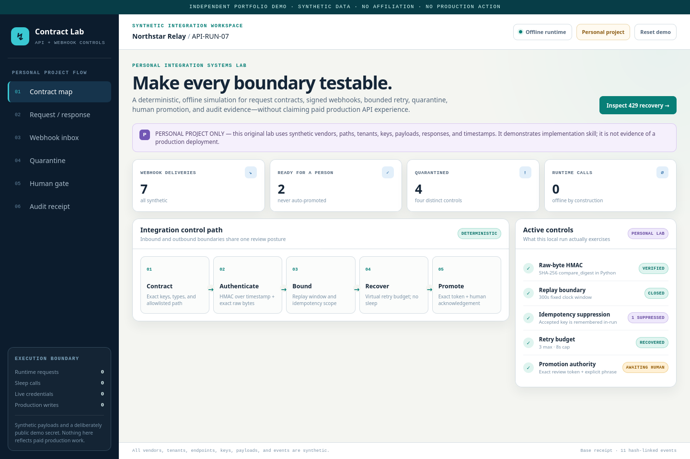

# API Integration Contracts

> INDEPENDENT PORTFOLIO DEMO · SYNTHETIC DATA · NO AFFILIATION · NO PRODUCTION ACTION

A clean-room Python contract engine and six-screen browser workspace for inspecting adverse API and webhook behavior. The exact synthetic fixture exercises request/response validation, HMAC verification, replay and idempotency order, schema quarantine, bounded virtual `429` recovery, a human gate, and a hash-linked receipt, with no network, sleep, persistence, or production write.



## Run in 60 seconds

Open `index.html` in a current browser. For the deterministic engine (Python 3.11 or 3.12, standard library only):

```bash
PYTHONDONTWRITEBYTECODE=1 PYTHONPATH=. python3 -B -m integration_lab demo
PYTHONDONTWRITEBYTECODE=1 PYTHONPATH=. python3 -B -m integration_lab verify artifacts/synthetic_receipt.json
```

No account, credential, server, endpoint, or runtime package is required.

## Five-minute walkthrough

1. Use **Contract map** to trace the fixed validation order.
2. On **Request / response**, inspect the supplied `429 → 429 → 202` sequence and virtual delays `[2, 4]` with zero sleep/network calls.
3. Filter **Webhook inbox** for duplicate and quarantined deliveries.
4. On **Human gate**, enter the visible review token and separately acknowledge the portfolio boundary.
5. Open **Audit receipt** and distinguish the verified base receipt from transient browser-only action state.

## Implemented

- Exact JSON schemas and bounded, duplicate-key/non-finite rejecting input parsing.
- Raw-byte HMAC fixture verification, fixed replay window, accept-only in-run idempotency, correlation checks, and schema-drift quarantine.
- Bounded virtual retry policy with terminal-attempt enforcement.
- An explicit two-control human gate and deterministic CLI receipt.
- Hash-linked events, full-receipt digest, 48 tests, 31 focused scan checks, and 12 real-Firefox checks.

## Architecture and data flow

Two local fixtures drive the Python engine. Evaluated states append canonical audit events and produce a deterministic receipt. `scripts/build_artifacts.py` derives the read-only browser snapshot from those exact bytes. The browser uses safe text nodes and in-memory UI state; it does not re-evaluate or contact an endpoint. See [ARCHITECTURE.md](ARCHITECTURE.md).

## Verify

```bash
make verify
```

Playwright/Firefox is verification-only and locked at the repository root. Generated artifacts are rebuilt in a temporary copy and compared exactly.

## Limitations and non-claims

The bundled HMAC value is deliberately public and synthetic; it is not a credential. The visible review token is a control-flow acknowledgement, not authentication or authorization. Hash chaining is not an immutable ledger, signature, identity proof, or trusted timestamp. There is no transport, durable idempotency store, queue, database, observability backend, vendor SDK, or deployment authority.

## Provenance

All vendors, tenants, endpoints, payloads, responses, amounts, events, and decisions are invented. See [PROVENANCE.md](PROVENANCE.md).

## License scope

Owner-created files are governed only by the repository root `LICENSE`. No external dataset or asset is bundled.
