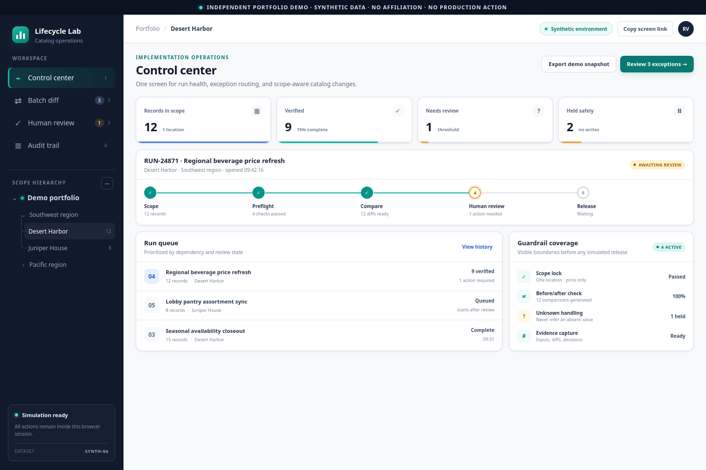

# Catalog Lifecycle

> INDEPENDENT PORTFOLIO DEMO · SYNTHETIC DATA · NO AFFILIATION · NO PRODUCTION ACTION

An offline interface demonstration for making catalog-change state legible before a person acts. It presents a control center, record-level batch diff, human-review queue, and audit view using twelve invented records and explicit verified, review, held, and unknown states.



## Run in 60 seconds

Open `index.html` directly in a current browser, or from the repository root run:

```bash
python3 -m http.server 8765 --bind 127.0.0.1
```

Then visit `http://127.0.0.1:8765/projects/catalog-lifecycle/`. No build, account, or runtime package is required.

## Five-minute walkthrough

1. Start at **Control center** and identify the fixed run boundary and queue sequence.
2. Open **Batch diff** and compare a verified record with the purple unknown record.
3. Move to **Human review** and show that an absent destination value is held rather than guessed.
4. Record a simulated local decision and open **Audit trail** to trace the decision and evidence boundary.

## Implemented

- Four responsive renderers and keyboard navigation.
- Twelve fixed synthetic records: nine verified, one review, and two held.
- Search, filters, selected-record continuity, explicit unknown-value handling, and in-memory decision state.
- Local JSON export and a compact audit presentation.
- Source-level safety, consistency, and accessibility-oriented smoke contracts.

## Architecture and data flow

`index.html` defines the semantic shell, `styles.css` supplies the local visual system, and `app.js` owns the fixed fixture plus render/state logic. Interaction state stays in browser memory and resets on refresh. There is no fetch, remote asset, browser storage, destination connector, or external write.

## Verify

From this project directory:

```bash
PYTHONDONTWRITEBYTECODE=1 python3 -B -m unittest discover -s tests -p 'test_*.py' -v
```

From the repository root, `python3 -B tools/release/static_demo_smoke.py projects/catalog-lifecycle/index.html` adds a real-Firefox disclosure, console, overflow, and automatic-network check.

## Limitations and non-claims

This is an interface simulation, not an integration or production automation claim. Event digests are illustrative identifiers, not cryptographic guarantees. Source checks are not accessibility certification. No authentication, persistence, concurrency, connector, or production action exists.

## Provenance

All names, identifiers, locations, values, timestamps, visual elements, and interactions are synthetic and original to the demo. See [PROVENANCE.md](PROVENANCE.md).

## License scope

Owner-created files are governed only by the repository root `LICENSE`. No additional rights are granted beyond that notice, GitHub's Terms, or applicable law.
