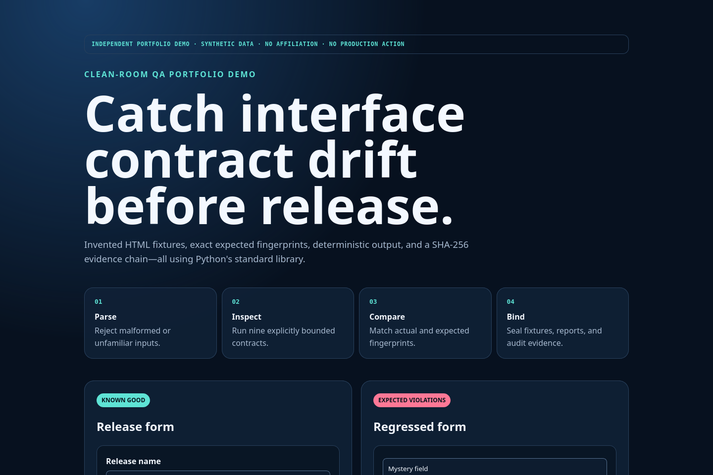

# Interface Contract Harness

> INDEPENDENT PORTFOLIO DEMO · SYNTHETIC DATA · NO AFFILIATION · NO PRODUCTION ACTION

A deterministic Python harness for catching drift in nine explicitly bounded, accessibility-oriented HTML fixture contracts. It parses invented components without rendering them, compares exact finding fingerprints, and emits reproducible JSON, Markdown, HTML, audit, and seal files.



## Run in 60 seconds

Requirements: Python 3.11 or 3.12; no runtime packages or network access.

```bash
python3 -B -m wcag_harness run --manifest fixtures/manifest.json --out build
python3 -B -m wcag_harness verify --audit build/audit.json --seal build/audit.sha256
python3 -B -m unittest discover -s tests -v
```

Open `build/report.html` or `demo/index.html` for static visual evidence.

## Five-minute walkthrough

1. Read `fixtures/manifest.json` to see one known-good and two intentionally regressed components.
2. Run the suite and compare expected with actual structural fingerprints.
3. Open `build/report.html` and trace a finding to its fixture and rule.
4. Verify `build/audit.json` against `build/audit.sha256`.
5. Change a fixture in a disposable copy and show that verification fails.

## Implemented

- Strict UTF-8, size, depth, element, attribute, schema, and path bounds.
- Nine documented rules covering language, IDs, names, references, headings, button types, and a table-header house contract.
- Exact expected-fingerprint comparison and stable exit codes.
- Canonical report generation, atomic replacement, input/output hashes, and a sealed audit record.
- Regression and tamper tests using only the Python standard library.

## Architecture and data flow

The strict manifest selects local HTML fixtures and rules. A non-rendering parser builds a bounded tree; rule functions emit structural findings; the engine compares exact fingerprints; report writers create deterministic evidence. The verifier re-hashes every bound input and output. Fixture markup is never executed or fetched.

## Verify

```bash
make check
python3 -B ../../tools/release/verify_generated.py --project .
```

The release verifier rebuilds the committed `build/` examples in a temporary copy and compares bytes rather than silently updating the tree.

## Limitations and non-claims

This is not a full WCAG conformance scanner, legal certification, browser test, accessibility audit, or assistive-technology test. A passing suite means actual fingerprints match the fixture's declared expectations. SHA-256 detects drift relative to known bytes; it does not prove authorship or truth.

## Provenance

All fixtures, rules, visual copy, and generated examples are synthetic/original. See [PROVENANCE.md](PROVENANCE.md) and [CLAIMS_AND_BOUNDARIES.md](CLAIMS_AND_BOUNDARIES.md).

## License scope

Owner-created files are governed only by the repository root `LICENSE`. No third-party dataset or asset is bundled.
